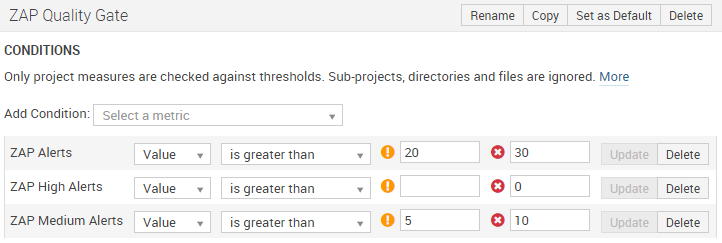
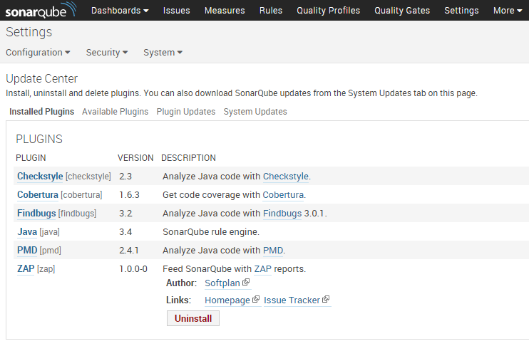

# Zap SonarQube Plugin
---

## Sumário

- [Introdução](#introdução)
- [Instalação](#instalação)
- [Configuração](#configuração)

## Introdução

O plugin do ZAP para o SonarQube permite integrar os resultados da análise do ZAP como novas métricas do SonarQube.
O plugin recebe como entrada o relatório gerado pelo ZAP e a partir dele define os valores das métricas, que são os números de alertas
de cada nível identificados pelo ZAP.

Cinco métricas foram criadas:
- ZAP Alerts (com o número total de alertas)
- ZAP High Alerts
- ZAP Medium Alerts
- ZAP Low Alerts
- ZAP Informational Alerts

A partir delas é possível acompanhar a regressão em segurança das aplicações através do SonarQube de forma simples e objetiva.
Um widget pode ser adicionado na página dos projetos, apresentando o número de alertas atual, assim como a tendência de cada métrica:


Além disso, é possível criar regras no *Quality Gate* que geram alertas ou quebram a build de acordo com os resultados do ZAP, como na imagem abaixo:



## Instalação

Para instalar o plugin, basta baixar o JAR, copiá-lo para a pasta `[sonarqube-installation]/extensions/plugins` e reiniciar o SonarQube.

[Clique aqui para fazer o download do plugin](http://server47:8087/artifactory/simple/libs-release-local/br/com/softplan/security/zap/zap-sonar-plugin/)

> O plugin é compatível com o SonarQube a partir da versão **5.1**.

Caso o plugin seja instalado com sucesso, ele será apresentado no *update center* do SonarQube, como mostra a imagem abaixo:



> Se o plugin não for instalado corretamente, o log do SonarQube provavelmente terá detalhes e informações sobre o problema. O log pode ser encontrado em `[sonarqube-installation]/logs/sonar.log`.

## Configuração

O plugin adiciona apenas uma propriedade de configuração que indica o caminho (absoluto ou relativo) do relatório HTML do ZAP. Em geral essa propriedade deve ser passada no POM do projeto ou adicionada no *sonar-project.properties*, caso o SonarQube Runner esteja sendo utilizado:

```xml
<!-- A linha abaixo deve ser adicionada dentro da tag <properties> do POM do projeto -->
<sonar.zap.reportPath>target/zap-reports/zapReport.html</sonar.zap.reportPath>
```

```properties
# Ou a mesma propriedade pode ser adicionada no sonar-project.properties caso o SonarQube Runner esteja sendo utilizado
sonar.zap.reportPath=target/zap-reports/zapReport.html
```

Entretanto, também é possível configurar o caminho do relatório no próprio SonarQube, de forma global ou para projetos específicos, como mostra a imagem abaixo:


> Caso o relatório encontre-se no caminho padrão (`target/zap-reports/zapReport.html`), não é necessário definir um valor para a propriedade.

---
:zap: