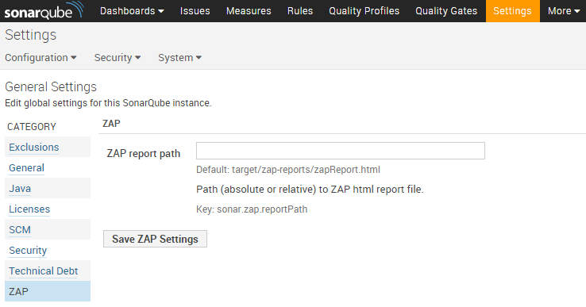

# ZAP SonarQube Plugin

[](https://travis-ci.org/pdsoftplan/sonar-zap)
[](https://coveralls.io/github/pdsoftplan/sonar-zap?branch=master)

> Check out the [ZAP Maven Plugin](https://github.com/pdsoftplan/zap-maven-plugin)

This plugin enables integration between [OWASP Zed Attack Proxy (ZAP)](https://www.owasp.org/index.php/OWASP_Zed_Attack_Proxy_Project) analysis results and [SonarQube](http://www.sonarqube.org/). It receives as input the report generated by ZAP, parses it, and define the values of the following new metrics:

- ZAP Alerts (with the total number of alerts);
- ZAP High Alerts;
- ZAP Medium Alerts;
- ZAP Low Alerts;
- ZAP Informational Alerts.

These metrics allow you to follow the security regression of your projects through SonarQube:


You can also create rules in a Quality Gate to trigger warnings and errors based on the number of identified alerts:


## Usage

> The plugin is compatible with SonarQube 5.1 onwards.

To install and use the plugin, just download the JAR file, copy it to `[your-sonarqube-installation]/extensions/plugins`, and restart SonarQube.

[Click here to download the plugin](https://github.com/pdsoftplan/sonar-zap/releases/download/1.0.0-0/sonar-zap-plugin-1.0.0-0.jar)

If the plugin is successfully installed, it will be present in the SonarQube update center, like in the image below:


> If the plugin isn't successfully installed, the SonarQube log will probably have details and information regarding the problem. The log can be found at `[your-sonarqube-installation]/logs/sonar.log`.

## Configuration

The plugin accepts only one configuration property that points to the path (absolute or relative) of ZAP's HTML report. Normally, this property should be written in the project's POM file or added to the *sonar-project.properties* file in case SonarQube Runner is being used:

```xml
<!-- The line below should be added within the <properties> tag in the project's POM file -->
<sonar.zap.reportPath>target/zap-reports/zap-report.html</sonar.zap.reportPath>
```

```properties
# Or the same property can be added to the sonar-project.properties file in case SonarQube Runner is being used
sonar.zap.reportPath=target/zap-reports/zap-report.html
```

However, it's also possible to set the report path globally or locally for any specific project in SonarQube:



> If the report is found at the default path (`target/zap-reports/zapReport.html`), it is not necessary to define a value for the property.

:zap:
